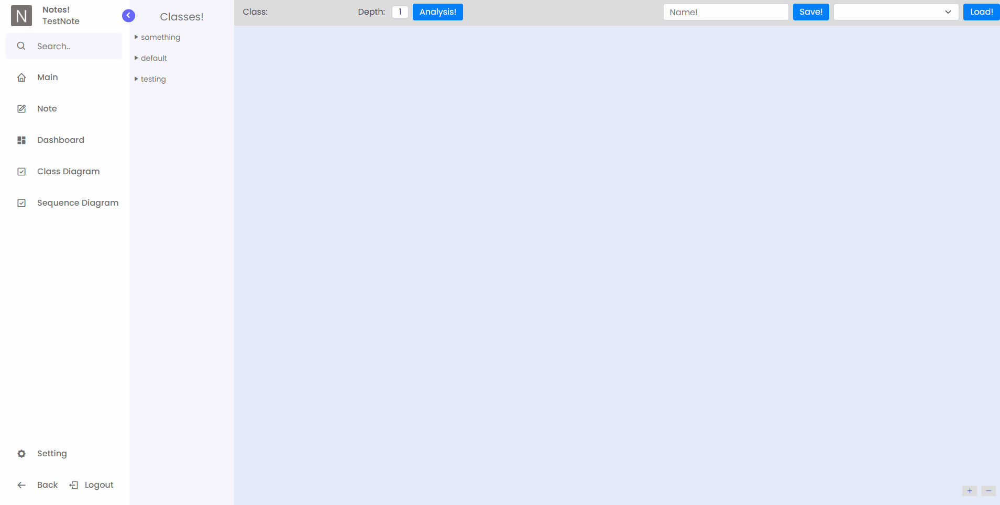
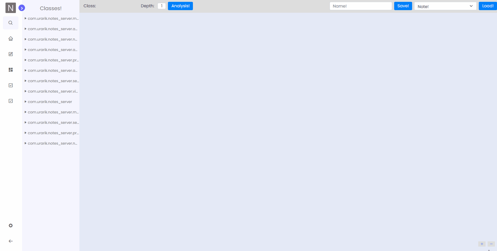
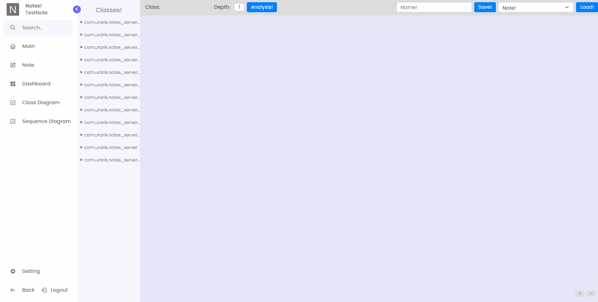

# Notes
Note web application for static java code analysis

## 목적
소프트웨어 유지보수성 향상을 위한 소프트웨어 구조 시각화 분석 및 협업 도구 개발.
  1. 협업을 위한 프로젝트/노트 생성 및 공유
  2. 코드 분석 기능
최종 업데이트 날짜 : 2022/04/30

### 프로젝트/노트 생성 및 공유

### 코드 분석
#### Class diagram

#### Sequence diagram

